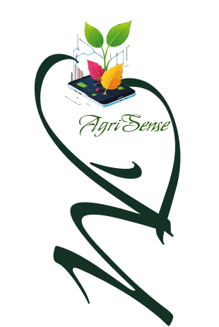

# 🌱 Agrisense



Agrisense is an innovative application designed to monitor soil conditions using advanced sensors and artificial intelligence. The app provides real-time insights into soil properties and weather conditions, helping farmers make informed decisions to optimize crop yield and health.

---

## 📌 Table of Contents

- [🚀 Features](#-features)
- [🛠 Technologies Used](#-technologies-used)
- [📥 Installation](#-installation)
- [📌 Usage](#-usage)
- [🤝 Contributing](#-contributing)
- [📜 License](#-license)
- [📞 Contact](#-contact)

---

## 🚀 Features

✅ **Soil Monitoring**: Utilize sensors to gather data on soil moisture, pH, and nutrient levels.
✅ **AI Image Analysis**: Capture images of the soil and analyze its properties using AI algorithms.
✅ **Weather Integration**: Access real-time weather data to understand its impact on soil conditions.
✅ **User-Friendly Dashboard**: An intuitive interface for users to view soil and weather data, recent activities, and recommendations.
✅ **Community Engagement**: Share insights and experiences with other users in the community section.

---

## 🛠 Technologies Used

- **Frontend**: React Native, Expo
- **Backend**: Node.js, Express *(future implementation)*
- **Database**: MongoDB *(future implementation)*
- **AI/ML**: TensorFlow.js or similar libraries for image analysis
- **Sensors**: Various soil sensors for data collection

---

## 📥 Installation

Clone the repository:
```sh
 git clone https://github.com/your-repo/agrisense.git
```

Navigate to the project directory:
```sh
 cd agrisense
```

Install dependencies:
```sh
 npm install
```

Set up environment variables:
- Create a `.env` file in the root directory and add your API URL:
```sh
 REACT_APP_API_URL=your_api_url_here
```

Start the development server:
```sh
 npm start
```

---

## 📌 Usage

1️⃣ Launch the app on your mobile device or emulator.
2️⃣ Create an account or sign in to access the dashboard.
3️⃣ Use the sidebar to navigate through different sections of the app.
4️⃣ Monitor soil conditions and weather data in real-time.

---

## 🤝 Contributing

Contributions are welcome! If you have suggestions for improvements or new features, please open an issue or submit a pull request.

1. **Fork the repository**.
2. **Create a new branch**:
   ```sh
   git checkout -b feature-branch
   ```
3. **Make your changes and commit them**:
   ```sh
   git commit -m "Add new feature"
   ```
4. **Push to the branch**:
   ```sh
   git push origin feature-branch
   ```
5. **Open a pull request**.

---

## 📜 License

This project is licensed under the MIT License - see the [LICENSE](LICENSE) file for details.

---

## 📞 Contact

📧 **Email**: agrisense@example.com
🌍 **Website**: [www.agrisense.com](https://www.agrisense.com)
🐙 **GitHub**: [Agrisense Repo](https://github.com/your-repo/agrisense)

# frontend
